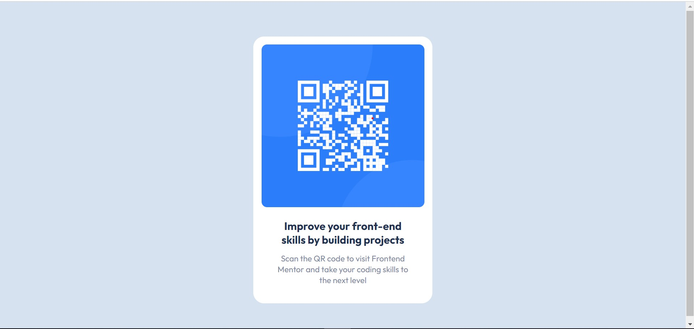

# Frontend Mentor - QR code component solution

This is a solution to the [QR code component challenge on Frontend Mentor](https://www.frontendmentor.io/challenges/qr-code-component-iux_sIO_H).

## Table of contents

- [Frontend Mentor - QR code component solution](#frontend-mentor---qr-code-component-solution)
  - [Table of contents](#table-of-contents)
  - [Overview](#overview)
    - [Screenshot](#screenshot)
    - [Links](#links)
  - [My process](#my-process)
    - [Built with](#built-with)
    - [What I learned](#what-i-learned)
    - [Useful resources](#useful-resources)
  - [Author](#author)

**Note: Delete this note and update the table of contents based on what sections you keep.**

## Overview

### Screenshot

### Links

- Solution URL: [GitHub Repo](https://github.com/1230fahid/qr-code-component)
- Live Site URL: [QR Code Component](https://1230fahid.github.io/qr-code-component/)

## My process

### Built with

- Semantic HTML5 markup
- CSS custom properties
- Flexbox
- CSS Grid

### What I learned
In this project I learned practiced my CSS skills a bit. I was familiar with flexbox but wanted to practice it. Also wanted to practice speed and efficiency. I'm not sure if this would even be a 10/10 design but I'm curious to know how I'll be graded as well. I did get to practice more with semantic HTML. Usually I just use divs which I know is bad practice, so I'm trying to fix that.

I need to focus on getting better at CSS before I pick up stuff like Tailwind. I still don't know what Styled Components are so I definitely need to learn it as well. Also in general, I need to get more familiar with media queries. 

### Useful resources

- In general, I find w3schools.com to be an extremely helpful resource.

## Author

- Website - https://github.com/1230fahid
- Frontend Mentor - [1230fahid](https://www.frontendmentor.io/profile/1230fahid)
